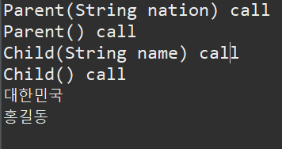
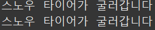
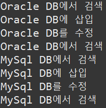

# 프린터 예제
```java
package printer;

import java.util.Scanner;

public class PrinterMain {// 남은 것 1. 상속 받는걸로 개선
	public static Card[] cardArray = new Card[100];// 100명의 카드생성 고객을 담을 곳, 카드에 전화번호와 프린트결재기능까지 있음
	public static Scanner scan = new Scanner(System.in);

	public static void main(String[] args) {
		int selectNo;
		boolean run = true;

		while (run) {// while+boolean으로 초기에 인쇄와 팩스 중 선택해서 나가기로
			System.out.println("===========================================");
			System.out.println("| 1. 인쇄 | 2. 팩스 | 3. 고객카드 생성 | 4. 종료|");
			System.out.println("===========================================");
			System.out.println("선택>> ");
			selectNo = scan.nextInt();
			System.out.println();

			switch (selectNo) {
			case 1:
				System.out.println("1. 인쇄");
				Print();// 인쇄에서 단면 양면을 셀렉하는 메소드로 이동
				break;
			case 2:
				System.out.println("2. 팩스");
				fax();// 팩스 메소드로 이동해서 등록된 프린터카드의 사람에게 팩스를 보냄
				break;
			case 3:
				System.out.println("3. 고객 카드 생성");
				CreateCard();// 에서 고객카드 생성
				break;
			case 4:
				System.out.println("4. 종료");
				run = false;
				break;
			default:
				System.out.println("잘못된 번호");
				break;
			}
			System.out.println();
		}
	}

	public static void Print() {
		boolean run = true;
		int selectNo;
		int selectNo2;
		int phoneNo;
		int color;
		String msg1 = "잔액이 부족합니다. 카운터에서 잔금을 결재해주세요.";

		while (run) {// 인쇄 까지 왔다 이제 단면인쇄랑 양면인쇄 구현
			System.out.println("========================");
			System.out.println("| 1.단면인쇄 | 2. 양면인쇄|");
			System.out.println("========================");
			System.out.println("선택>>");
			selectNo = scan.nextInt();

			if (selectNo == 1) { // 이번엔 if문을 써보고 싶었음. 위처럼 while도 가능
				System.out.println("1. 단면인쇄");
				System.out.println();
				System.out.println("핸드폰 뒷자리 입력 : ");
				phoneNo = scan.nextInt();
				Card card = findCard(phoneNo);
				if (card == null) {
					System.out.println("미등록 고객");
					System.out.println();
					return;
				}
				System.out.println("출력 매수");
				SinglePrint singlePrt = new SinglePrint(100); // 단면인쇄로
				selectNo2 = scan.nextInt();
				// 흑백 컬러를 여기서 구현. 흑백 50원 컬러 100원
				System.out.println("========================");
				System.out.println("| 1.흑백인쇄 | 2. 컬러인쇄|");
				System.out.println("========================");
				color = scan.nextInt();
				if (color == 1) {
					singlePrt.SinglePrt(selectNo2);
					card.setBalance(card.getBalance() - (selectNo2 * 50));// 출력매수 만큼 감소
					if (card.getBalance() < 0) {
						System.out.println(msg1);
						break;
					}
					System.out.println("남은 잔액 : " + card.getBalance());
					run = false;
				} else if (color == 2) {
					singlePrt.SinglePrt(selectNo2);
					card.setBalance(card.getBalance() - (selectNo2 * 100));
					if (card.getBalance() < 0) {
						System.out.println(msg1);
						break;
					}
					System.out.println("남은 잔액 : " + card.getBalance());
					run = false;
				} else {
					System.out.println("잘못된 번호");
					return;
				}

			} else if (selectNo == 2) {
				System.out.println("2. 양면인쇄");
				System.out.println();
				System.out.println("핸드폰 뒷자리 입력 : ");
				phoneNo = scan.nextInt();
				Card card = findCard(phoneNo);
				if (card == null) {
					System.out.println("미등록 고객");
					System.out.println();
					return;
				}
				System.out.println("출력 매수");
				DoublePrint doublePrt = new DoublePrint(100);
				selectNo2 = scan.nextInt();
				System.out.println("========================");
				System.out.println("| 1.흑백인쇄 | 2. 컬러인쇄|");
				System.out.println("========================");
				color = scan.nextInt();
				if (color == 1) {
					doublePrt.DoublePrt(selectNo2);
					card.setBalance(card.getBalance() - (selectNo2 * 50));
					if (card.getBalance() < 0) {
						System.out.println(msg1);
						break;
					}
					System.out.println("남은 잔액 : " + card.getBalance());
					run = false;
				} else if (color == 2) {
					doublePrt.DoublePrt(selectNo2);
					card.setBalance(card.getBalance() - (selectNo2 * 100));
					if (card.getBalance() < 0) {
						System.out.println(msg1);
						break;
					}
					System.out.println("남은 잔액 : " + card.getBalance());
					run = false;
				}
//                doublePrint();//양면인쇄로

			} else {
				System.out.println("잘못된 번호");
			} // 인쇄도 여기서 다 구현해버리자 if안에서
		}
	}

	public static void fax() {// 팩스는 팩스전송(고객확인 후 일치하면 성공하는작업, 미등록고객은 생성하라고)
		int phoneNo1;// 내 번호
		int phoneNo2;// 상대 번호
		int FaxNo; // 팩스 보내는 매수

		System.out.println("*주의* 등록된 고객에게만 전송가능");
		System.out.println("보내시는분 번호 : ");
		phoneNo1 = scan.nextInt();
		Card card1 = findCard(phoneNo1);
		if (card1 == null) {// 보내는 사람이 등록되어있는지
			System.out.println("미등록 고객");
			System.out.println();
			return;
		}
		System.out.println("받으시는분 번호 : ");
		phoneNo2 = scan.nextInt();
		Card card2 = findCard(phoneNo2);
		if (card2 == null) {// 받는사람이 등록되어있는지
			System.out.println("미등록 고객");
			System.out.println();

		} else {
			System.out.println("팩스 보내시는 매수 : ");
			FaxNo = scan.nextInt();
			card1.setBalance(card1.getBalance() - (FaxNo * 50));
			System.out.println("전송 성공");
			System.out.println("남은잔액 : " + card1.getBalance());
		}

	}

	public static void CreateCard() {
		int phoneNo;
		String owner;
		int balance;

		System.out.println("핸드폰 뒷자리 입력 : ");
		phoneNo = scan.nextInt();
		System.out.println("고객 성명 : ");
		owner = scan.next();
		System.out.println("초기 잔액 : ");
		balance = scan.nextInt();
		// 이제 고객들을 배열로 저장해보자

		Card newCard = new Card(phoneNo, owner, balance);
		for (int i = 0; i < cardArray.length; i++)
			if (cardArray[i] == null) {
				cardArray[i] = newCard;
				System.out.println("카드 발급 완료");
				break;
			} // 카드생성까지 완료
	}

	private static Card findCard(int phoneNo) {
		Card card = null;
		for (int i = 0; i < cardArray.length; i++) {
			if (cardArray[i] != null) {
				int dbPhoneNo = cardArray[i].getPhoneNo();
				if (dbPhoneNo == phoneNo) {
					card = cardArray[i];
					break;
				}
			}
		}
		return card;

	}

}

> 메인

```java
package printer;

public class SinglePrint {
	private int numOfPaper;

	public SinglePrint(int numOfPaper) {
		this.numOfPaper = numOfPaper;
	}

	public SinglePrint() {

	}

	public void SinglePrt(int amount) {// amount는 내가 사용할 용지 매수
		// 이제 고객 조회를 하고 있는지 확인하고 amount만큼 차감
		if (numOfPaper == 0) {
			System.out.println("인쇄용지 부족");
		} else if (numOfPaper < amount) {// 사용할 용지가 초기용지보다 큰경우 알아서 잘 복사하고 남은 용지 표시해야함
			System.out.println((amount - numOfPaper + "매 부족합니다"));
		} else {// 남은 경우는 사용할 용지가 초기 용지보다 작은경우 그냥 올바르게 프린트된다
			numOfPaper -= amount;

			System.out.println("프린터에 용지가 "+numOfPaper + "매 남았습니다");

		}
	}

}

```

> 단면인쇄

```java

package printer;

public class DoublePrint {
	private int numOfPaper;

	public DoublePrint(int numOfPaper) {
		this.numOfPaper = numOfPaper;
	}

	public DoublePrint() {

	}

	public void DoublePrt(int amount) {// amount 는 내가 사용할 용지 매수
		if (amount % 2 == 1) {
			amount = amount + 1;// 홀수일때 +1을 준다
		}

		if (numOfPaper == 0) {
			System.out.println("인쇄용지 부족");
		} else if (numOfPaper < Math.round(amount / 2)) {// 사용할 용지가 초기용지보다 큰경우 알아서 잘 복사하고 남은 용지 표시해야함
			System.out.println((Math.round(amount / 2) - numOfPaper + "매 부족합니다"));
		} else {// 남은 경우는 사용할 용지가 초기 용지보다 작은경우 그냥 올바르게 프린트된다
			numOfPaper -= Math.round(amount / 2);
			System.out.println("프린터에 용지가 "+numOfPaper + "매 남았습니다");

		}
	}

}

```

> 양면 인쇄

```java
package printer;

public class Card { // 계정을 만들고싶다
	private int phoneNo;
	private String owner;
	private int balance;

	public Card(int phoneNo, String owner, int balance) {
		this.phoneNo = phoneNo;
		this.owner = owner;
		this.balance = balance;
	}

	public int getPhoneNo() {
		return phoneNo;
	}

	public void setPhoneNo(int phoneNo) {
		this.phoneNo = phoneNo;
	}

	public String getOwner() {
		return owner;
	}

	public void setOwner(String owner) {
		this.owner = owner;
	}

	public int getBalance() {
		return balance;
	}

	public void setBalance(int balance) {
		this.balance = balance;
	}

}

```
> 카드계정
   
# p.775 예제7번
>List컬렉션에 대한 이해   
```java
//package Exam;

public class Board {//완성 예제7
	private String title;
	private String content;
	
	public Board(String title, String content) {
		this.title = title;
		this.content = content;
	}

	public String getTitle() {
		return title;
	}

	public String getContent() {
		return content;
	}
	
	
	
	

}
```
- 제목과 내용에 대한 기본 설계
- 프라이빗을 줬기때문에 게터세터까지

```java
//package Exam;

import java.util.ArrayList;
import java.util.List;

public class BoardDao {//완성 예제7
	public List<Board> getBoardList(){//getBoardList라는 메소드를 생성하는데 타입이 스트링 인트 이런게 아니라 List<Board>라는 타입 Board는 다른 클래스에서 생성자를 미리 만듬. 제네릭으로 스트링, 스트링 을 줘도 되는데 설계에 작성된 생성자타입을 그냥 가져다 쓰면 편함
		List<Board> list = new ArrayList<Board>();
		list.add(new Board("제목1", "내용1"));
		list.add(new Board("제목2", "내용2"));
        list.add(new Board("제목3", "내용3"));
		
		return list;//여기서 나온 값은 list이니 list를 getBoardList를 호출하면 나오도록 저장
		
	}
}
```
   
- 해당예제의 메소드클래스
- Board라는 제네릭을 주고 그냥 선입력으로 제목 내용을 줘버림
- 리턴값으로는 list객체 자체를 리턴줘버리면 된다

```java
//package Exam;

import java.util.List;

public interface ListExample {// 완성 예제7
	public static void main(String[] args) {
		BoardDao dao = new BoardDao();
        List<Board> list = dao.getBoardList();
        for(Board board : list) {
            System.out.println(board.getTitle()+"-"+board.getContent());
        }
	}
	

}
```
- 예제7번의 실행클래스
- BoardDao를 dao라는 객체로 담고 또 리스트라는 객체의 dao의 프라이빗값을 가져와 담음
- 인덱스가 없기때문에 향상된 for문을 사용해서 표현함

# p.776 예제 8번
> HashSet의 이해

```java
//package Exam2;
import java.util.Objects;

public class Student {//완성 예제 8번
    public int studentNum;
    public String name;

    public Student(int studentNum, String name) {
        this.studentNum = studentNum;
        this.name = name;
    }
    @Override
    public int hashCode(){
       return Objects.hash(studentNum);
    }

    @Override
    public boolean equals(Object obj) {//단순히 여기서는 학번(sNum)만 비교해서 같으면 없애버렷으면 됬음
        if(obj instanceof Student){
            Student student = (Student) obj;
            return (studentNum==student.studentNum);
        }else {
            return false;
        }
    }
}
```
- 예제 8번의 설계 클래스
- 쪼끔 함정이었던게 이름과 학번 둘다 비교를 해버리게끔 해놓음
- 단순히 학번이 중복되면 저장이 안돼도록 하는게 이 예제의 핵심
- 따라서 중복 학번을 비교하여 boolean으로 처리

```java
//package Exam2;

import java.util.HashSet;
import java.util.Iterator;
import java.util.Set;

public class HashSetExample {//완성 예제 8번
    public static void main(String[] args) {
        Set<Student> set = new HashSet<Student>();

        set.add(new Student(1,"홍길동"));
        set.add(new Student(2,"신용권"));
        set.add(new Student(1,"조민우"));

        Iterator<Student> iterator = set.iterator();
        while (iterator.hasNext()){
            Student student = iterator.next();
            System.out.println(student.studentNum+":"+student.name);
        }
   }
}
```
- 예제 8번의 실행 클래스
- 생성자 3개를 생성하고
- Iterator로 설계클래스타입을 기준으로 여기서 세팅한값(set.add~)을 iterator에 담는다
- While문으로 iterator의 정해진 갯수의 세팅한 값을 불러오고
- 불러온값을 Student클래스의 hascode메소드와 equals메소드에 돌려봄
- 따라서 중복된 학번 '1'은 저장되지 않고 '1,홍길동'이 나옴

# p.778 예제 9번
```java
package Exam;
import java.util.HashMap;
import java.util.Map;
import java.util.Set;

public class MapExample {// 해쉬맵+ 맵+ 셋+ 향상된 for문
    public static void main(String[] args) {
        Map<String, Integer> map = new HashMap<>();
        // 기본 전제조건, 맵이란 객체에 해쉬맵형식을 담을거고 그 타입형식은 <스트링, 인티저> --->맵사용의 기본구조
        // 여기서 String이 키타입 Integer는 값타입
        // 뒤에 제네릭이 빠진이유는 명시적 인수타입 이라서
        map.put("blue",96);
        map.put("hong",86);
        map.put("white",92);
        // 세가지 값 입력

        String name = null;
        int maxScore = 0;
        int totalScore = 0;
        // 여기까지가 기본입력
        Set<Map.Entry<String, Integer>> entrySet = map.entrySet();
        //엔트리셋은 임포트한 set의 내장된 명령어로 맵 내부의 저장된 데이터를 다 불러오는 명령어
        //따라서 엔트리셋으로 불러온 데이터를 엔트리셋 객체에 전부 담아줌
        //배열로 따지면 int[] mapArray = new map[] 이랑 비슷한 구조
        for(Map.Entry<String, Integer> entry : entrySet){
            if(entry.getValue() > maxScore){
                //엔트리에서 맵의 값 타입을 맥스 스코어와 비교를하고
                //맥스스코어보다 크면 엔트리의 키 타입을 name에, 값 타입을 맥스스코어에 담는다
                name = entry.getKey();
                maxScore = entry.getValue();
            }
            totalScore += entry.getValue();
            //if를 다 돌때까지 값 타입을 누적하며 더하면서 점수합계를 구한다
        }

        System.out.println("평균점수 : "+totalScore/map.size());
        //map의 갯수는 size를 이용한다
        System.out.println("최고점수 : "+maxScore);
        System.out.println("최고점수를 받은 사람 : "+name);
    }
}
```
- hashMap에 관한 예제로 몇 번 더 연습하기 좋을듯

# p.778 예제 10번
```java
package Exam;

import java.util.TreeSet;

public class TreeSetExample {
    public static void main(String[] args) {
        TreeSet<Student> treeSet = new TreeSet<>();
        treeSet.add(new Student("blue",96));
        treeSet.add(new Student("hong",86));
        treeSet.add(new Student("white",92));

        Student student = treeSet.last();
        System.out.println("최고점수 : "+student.score);
        System.out.println("최고점수를 받은 아이디 : "+student.id);
    }
}
```
- 실행클래스

```java
package Exam;

public class Student implements Comparable<Student>{
	//트리셋은 비교메소드가 무조건 필요함
	//따라서 비교관련 인터페이스인 Comparable을 구현하고
	//오버라이드로 Comparable의 내부 메소드compareTo를 재정의해서 값을 비교하게 해야함
    public String id;
    public int score;

    public Student(String id, int score) {
        this.id = id;
        this.score = score;
    }
    @Override
    public int compareTo(Student o){
//        if(score<o.score) return -1;
//        else if(score==o.score) return 0;
//        else return 1;
    	//방법1

        Integer.compare(score,o.score);
        return score-o.score;
        //방법2
    }
    // 여기서 왜 -1 0 1 값만 구하느냐
    // 트리셋은 자료를 입력순서와 관계없이 오름차순으로 정렬해주기 때문에
    // 크기가 -1인 자료값부터 정렬한다
    // 따라서 크기가 1인 값을 출력하면 제일 큰 점수가 나오고
    // 이거를 메인에서 last로 불러서 출력하면 된다

}
```
- 10번 예제는 설계클래스가 핵심
- Tree에 대한 이해가 필요함

# 백준예제 1002번

```java
package Exam;

import java.util.Scanner;

public class backjoon1002 {

	public static void main(String[] args) {
		Scanner sc = new Scanner(System.in);
		int T = sc.nextInt();
		
		while (T-->0) {
			int x1 = sc.nextInt();
			int y1 = sc.nextInt();
			int r1 = sc.nextInt();
			
			int x2 = sc.nextInt();
			int y2 = sc.nextInt();
			int r2 = sc.nextInt();
			
			System.out.println(tangent_point(x1,y1,r1,x2,y2,r2));
		}
	}
	public static int tangent_point(int x1, int y1, int r1, int x2, int y2, int r2) {
		int distance_pow = (int)(Math.pow(x2-x1, 2)+Math.pow(y2-y1, 2));
		
		if(x1==x2&&y1==y2&&r1==r2) {
			return -1;
		}
		else if(distance_pow > Math.pow(r1+r2, 2)) {
			return  0;
		}
		else if (distance_pow < Math.pow(r2-r1, 2)) {
			return 0;
		}
		else if (distance_pow == Math.pow(r2-r1, 2)) {
			return 1;
		}
		else if (distance_pow == Math.pow(r2+r1, 2)) {
			return 1;
		}
		else {
			return 2;
		}
	}

}
```
> ㅎㅎ ㅈㅅ
- 임의의 두점과 제시되는 한점의 거리 구하기
- (x1,y1)과 (x2,y2) 그리고 r1,r2로 표현
- 원과 원 관계로 나타낸 식
- 너무 수학적인 걸 안들고 오겠다는 결심을 하게됨

# 백준 예제 1003번
```java
import java.util.Scanner;

public class backjoon {//코드에 N이 40이고 우리는 0,1 두가지만 쓰니 2차원배열 사용
    static Integer[][] dp = new Integer[41][2];

    public static void main(String[] args) {
        Scanner sc = new Scanner(System.in);

        dp[0][0] = 1;
        dp[0][1] = 0;
        dp[1][0] = 0;
        dp[1][1] = 1;

        int T = sc.nextInt();// 첫번째 입력으로는 우리가 while을 돌릴 횟수. 초과시 while탈출

        while (T--> 0) {
            int N = sc.nextInt();// 두번째 입력은 해당 피보나치수가 나옴
            f(N);
            System.out.println(dp[N][0] + " " + dp[N][1]);
        }
    }
    static Integer[] f(int N) {
        if (dp[N][0] == null || dp[N][1] == null) {
            dp[N][0] = f(N - 1)[0] + f(N - 2)[0];
            dp[N][1] = f(N - 1)[1] + f(N - 2)[1];
        }
        return dp[N];
    }
}
```
- 피보나치 수열을 계산해주는 프로그램
- 첫번째 입력으로 이 프로그램을 몇회 돌릴지 정하고
- 두번째 입력으로 Fn번째 피보나치 수열을 계산해줌

# 자바 상속+인터페이스
```java
/*
*상속 예제
*/
package inherit;

public class Parent {
	public String name;

	public Parent(String name) { 
		this.name = name;

    }

}

public class Child extends Parent{
	private int studentNo;

    public Child(String name, int studentNo){
    	super(name);
		//super를 줘서 부모생성자를 땡겨온다
		// 부모생성자를 지우는 것도 있는데 이건 위험한방법
        this.name = name;
        this.studentNo = studentNo;
    }

}
```
```java
public class Parent {
	public String nation;

    public Parent(){
        this("대한민국");
        System.out.println("Parent() call");
    }
    public Parent(String nation) {
        this.nation = nation;
        System.out.println("Parent(String nation) call");
    }

}

public class Child extends Parent{
	private String name;

    public Child(){
        this("홍길동");
        System.out.println("Child() call");
    }

    public Child(String name) {
        this.name = name;
        System.out.println("Child(String name) call");
    }

    public String getName() {
        // 게터 세터추가해서 부모에 한번 사용해보고 exam에서도 사용해볼 예정
        return name;
    }

    public void setName(String name) {
        this.name = name;
    }

}
public class ChildExample {

	public static void main(String[] args) {
		Child child = new Child();
        System.out.println(child.nation);// 부모에 있는 nation을 땡겨쓰기 가능
        System.out.println(child.getName());
	}

}
```


```java
public class Tire {
	public void run(){
        System.out.println("일반 타이어가 굴러갑니다");
    }

}
public class SnowTire extends Tire {
	@Override
	public void run() {
		System.out.println("스노우 타이어가 굴러갑니다");
	}

}
public class SnowTireExample {

	public static void main(String[] args) {
		SnowTire snowTire = new SnowTire();
        Tire tire = snowTire;

        snowTire.run();
        tire.run();
	}

}
```

```java
/*
*인터페이스 예제
*/
public interface Soundable {
	String sound();//1.추상메소드를 미리 생성

}
public class Cat implements Soundable{
	@Override
    public String sound() {
        return "야옹";
        // 2.간단하게 Soundable에 있는 sound()추상메소드를
        // 재정의해서 쓰면 되기때문에 땡겨오고
        // 리턴값으로 "야옹"을 줌
    }

}
public class Dog implements Soundable{
	@Override
    public String sound() {
        return "멍멍";
    }

}
public class SoundableExample {
	
	private static void printSound(Soundable soundable){
        System.out.println(soundable.sound());
    }

	public static void main(String[] args) {
		printSound(new Cat());
        // 여기 이말뜻은 printSound메소드를 발동시키는데
        // new Cat()을 대입시킨다
        // 즉 Soundable soundable = new Cat 이라는 객체를 생성하겠다는 말이랑 똑같은말
        printSound(new Dog());
    
	}

}
```
```java
public interface DataAccessObject {
	void select();
    void insert();
    void update();
    void delete();

}
public class MySqlDao implements DataAccessObject{
	@Override
    public void select(){
        System.out.println("MySql DB에서 검색");
    }

    @Override
    public void insert() {
        System.out.println("MySql DB에 삽입");
    }

    @Override
    public void update() {
        System.out.println("MySql DB를 수정");
    }

    @Override
    public void delete() {
        System.out.println("MySql DB에서 검색");
    }

}
public class OracleDao implements DataAccessObject{
	@Override
    public void select(){
        System.out.println("Oracle DB에서 검색");
    }

    @Override
    public void insert() {
        System.out.println("Oracle DB에 삽입");
    }

    @Override
    public void update() {
        System.out.println("Oracle DB를 수정");
    }

    @Override
    public void delete() {
        System.out.println("Oracle DB에서 검색");
    }
}
public class DaoExample {
	public static void dbWork(DataAccessObject dao){
        dao.select();
        dao.insert();
        dao.update();
        dao.delete();
    }

    public static void main(String[] args) {
        dbWork(new OracleDao());
        dbWork(new MySqlDao());
    }
}
```

```java
public interface Action {
	void work();

}
public class ActionExample {

	public static void main(String[] args) {
		Action action = new Action() {
            @Override
            public void work() {
                System.out.println("복사를 합니다");
            }
        };

        action.work();
	}

}
```

# 백준예제 1008번
```java
package exam;

import java.io.BufferedReader;
import java.io.IOException;
import java.io.InputStreamReader;
import java.util.Scanner;
import java.util.StringTokenizer;

public class backjoon1008 {
    public static void main(String[] args) throws IOException {
        BufferedReader br = new BufferedReader(new InputStreamReader(System.in));

        String str = br.readLine();
        StringTokenizer st = new StringTokenizer(str," ");
        double a = Double.parseDouble(st.nextToken());
        double b = Double.parseDouble(st.nextToken());

        System.out.println(a/b);
    }
}
```
- 기본적인 예제 이지만
- bufferedReader를 사용해본 예제
